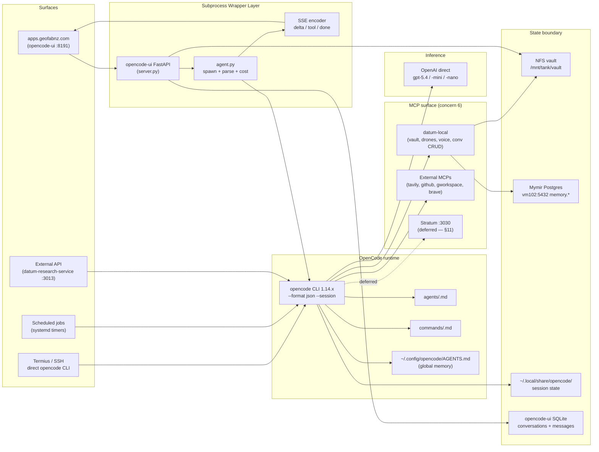

# Datum Architecture — OpenCode Migration

**Status:** Draft v1 — under Developer review
**Owner:** Manager
**Companion:** `README.md` (umbrella plan), `memory.md` (decisions log)
**Scope:** target-state architecture for the platform after Claude Code is retired. MVP-first.

This document covers what the system *is*, what each piece *guarantees*, and where the boundaries are. It is separate from `README.md` (which is the operational plan: phases, tasks, dates). It exists so that no one — including the agent doing the work — has to reason about architecture from task lists.

---

## 1. Why this doc exists (and why MCP is downstream of it)

The README is execution-focused: phases, tasks, gates. That's necessary but insufficient. Without a clear architectural target we end up with **dark code** — modules that work but no human can explain — and that's the failure mode the project-level `CLAUDE.md` (`Dark Code Prevention` section) is built to prevent.

The platform has six concerns, in priority order:

1. **Subprocess contract.** The thing that replaces `claude` CLI. Everything else is built on this.
2. **State boundary.** Where does session state live? What survives a process restart?
3. **Cost + safety guardrails.** No agent should be able to burn $50 in a runaway loop. No agent should be able to take destructive action without our consent (this is already enforced by the Sysbox container model on Pelorus, but the rules need to be explicit).
4. **Persona isolation.** 24 personas, one process tree. Identity drift is a known failure mode.
5. **Observability.** Token counts, cost, tool calls — all per-task, all queryable.
6. **MCP surface.** What tools the agent can call. Important, but downstream of 1–5.

MCP-the-question (Stratum, datum-local, namespace collisions) is **concern 6**. It cannot be resolved until concerns 1–4 are stable. That is what reorders the priority from the original spec.

---

## 2. MVP definition

The MVP is **"Claude Code is retired, Datum still works."** That is it. Anything that does not contribute to that sentence being true on 2026-06-01 is out of MVP scope.

### In MVP

| Capability | Why it's MVP |
|---|---|
| `opencode run --format json --session <id>` wrapped by `agent.py`, emitting SSE `delta`/`tool`/`done` to the UI | Without this, no chat works |
| Per-persona system prompt routing through one OpenAI account (`gpt-5.4` / `-mini` / `-nano`) | Without this, personas don't have identity |
| Token + USD cost capture from `step_finish` event | Without this, we cannot ship safely (a runaway loop is an unbounded bill) |
| Per-task USD cap with hard termination | Same reason |
| `datum-local` MCP registered (vault, drones, conversation CRUD) | Without this, the persona fleet loses ~60% of its capability |
| 24 personas pass a minimal smoke test (init + one tool call + `/handoff`) | Without this, we don't know what's broken until users find it |
| vm102 datum-ui stopped (cold standby) so NFS vault has a single writer | Without this, race conditions in vault writes carry forward |
| Scheduled jobs (`daily_brief.sh`, `schedule` skill) swapped to opencode | Without this, June 2 the cron jobs start hitting an unmetered Anthropic OAuth path that no longer exists |
| Claude CLI staying installed (not in PATH for prod) for 30-day rollback | Without this, we have no rollback story |

### Explicitly out of MVP (deferred)

- Stratum MCP integration (covered separately in §11)
- UI v3 (PWA, Monaco, MapLibre, AG Grid, multi-agent dashboard) — see `~/vault/research/datum-ui-design-2026.md`
- Mymir phase F (claim extraction)
- Multi-provider failover (Anthropic BYOK, DeepSeek, Gemini) — single vendor first
- Per-persona prompt caching tuning
- Token-budgeted context window strategy (research, but ship default first)

The rule (from project umbrella): **anything Pelorus can build for itself after the cutover is lower priority than what makes the cutover possible.**

---

## 3. Target-state component diagram

Box outlines map to ownership: **Wrapper** is ours (this project), **CLI** is upstream (sst/opencode — we configure, not modify), **Provider** is OpenAI (just an API), **MCP** is a mix (datum-local is ours, the rest is upstream), **State** is the trust boundary.

---

## 4. Component contracts (per Dark Code Prevention rules)

Each component below answers: purpose, dependencies, dependents, failure modes, behavioural contract. These will become per-module `MANIFEST.md` files in their respective repos as Phase B–G land.

### 4.1 `agent.py` — subprocess wrapper

- **Purpose.** Spawn `opencode run --format json [--session <id>]`, parse the event stream, emit SSE `delta`/`tool`/`done` events to the FastAPI route, capture cost+tokens from `step_finish`.
- **Does NOT.** Decide on model. Decide on persona. Touch the vault. Talk to MCPs directly. Persist conversations (that's `db.py` in opencode-ui).
- **Dependencies.** `opencode` binary in PATH; OPENAI_API_KEY in env; `~/.config/opencode/opencode.json` valid.
- **Dependents.** `server.py` (opencode-ui's FastAPI), and any future API consumer of the same subprocess pattern.
- **Failure modes.** (a) opencode binary missing → return 503, log, surface in UI. (b) Process spawns then exits non-zero before first event → emit `done` with error, no orphan PID. (c) Process hangs >30s with no output → SIGTERM after grace period, emit `done` with timeout error. (d) Cost cap breached mid-stream → SIGTERM cleanly, emit `done` with cap-exceeded error, preserve partial output. (e) Malformed JSON in stream → log, skip line, continue (do not crash the wrapper).
- **Behavioural contract.** Cost+tokens in `done` event are *real values from the provider*, not estimates. Session ID round-trips intact. No retries on transient errors — the UI handles retry semantics, not the wrapper.

### 4.2 `opencode-ui server.py` — HTTP/SSE surface

- **Purpose.** Receive POST `/api/conversations/{cid}/messages`, look up `cc_session_id` from SQLite, call `agent.py`, stream SSE back. Receive other CRUD routes for conversations/personas/uploads.
- **Does NOT.** Spawn opencode directly (that's `agent.py`'s job). Make provider calls. Read OPENAI_API_KEY (it just needs to be in the env that's passed to the child).
- **Dependencies.** SQLite at `data/datum-ui.db`; `agent.py`; `personas.py`; the file system for uploads.
- **Dependents.** Browser frontend `static/app.js`; external API consumers; potentially `datum-research-service` (Phase G).
- **Failure modes.** (a) SQLite locked → return 503 with retry-after. (b) Persona ID not found → 404. (c) `agent.py` raises → close SSE with error frame.
- **Behavioural contract.** Session ID stored on first `system` event in the stream. Auto-title triggers on 2nd user message. User messages capped at 32k chars (already enforced).

### 4.3 `~/.config/opencode/opencode.json` — runtime configuration

- **Purpose.** Single source of truth for: provider keys, default + per-persona models, MCP server registrations, permission profile.
- **Does NOT.** Hold secrets directly (env var refs only). Embed business logic.
- **Dependencies.** `~/.secrets.env` is sourced before opencode launches (auth fix, Phase A).
- **Dependents.** Every opencode invocation, every persona agent, every MCP-using flow.
- **Failure modes.** (a) Malformed JSON → opencode refuses to start. Detected at boot. (b) Bad model ID → first request fails. Phase E acceptance covers this. (c) MCP command path wrong → tool list missing that MCP's tools. Phase B acceptance covers this.
- **Behavioural contract.** Version-controlled. Each change captured in `decisions/`. No silent edits.

### 4.4 `~/.config/opencode/agents/<persona>.md` — persona definitions

- **Purpose.** Persona-specific system prompt, per-persona model override, per-persona tool allowlist.
- **Does NOT.** Hold workspace state. Reference other personas directly. Embed credentials.
- **Dependencies.** Global `AGENTS.md`; per-persona vault path under `~/vault/workspaces/<persona>/`.
- **Dependents.** Opencode CLI when invoked with `--agent <persona>`.
- **Failure modes.** (a) Persona missing → opencode falls back to global. Need explicit error if persona was requested by name. (b) Tool allowlist contradicts global → undefined. Resolve in Phase C smoke test.
- **Behavioural contract.** Each persona owns its own `tasks.md`, `scratch.md`, `past_jobs.md` paths. Cross-persona communication via `~/vault/shared/handoff.md` only.

### 4.5 `datum-local` MCP

- **Purpose.** Datum-internal tool surface: `vault_search`, `vault_read`, `conversation_*`, `dispatch_drone`, `voice_tts`, `screenshot_url`, `skill_execute`, `nzffd_download`, `leaflet_map_*`.
- **Does NOT.** Make LLM calls itself. Manage agent state. Cache results (caching is the caller's concern).
- **Dependencies.** Read access to NFS vault; HTTP access to vm111 drone endpoints; HTTP access to TTS service; PostgreSQL for conversation queries.
- **Dependents.** Any persona that calls one of its tools. The opencode CLI registers it as an MCP.
- **Failure modes.** (a) NFS mount stale → vault tool calls fail with clear error (not silent empty results). (b) Drone endpoint down → `dispatch_drone` returns 503 immediately; do not block. (c) Postgres down → conversation tools fail with retry-after suggestion.
- **Behavioural contract.** All tools idempotent where possible. `dispatch_drone` returns `taskId` synchronously and *does not block on completion*. State changes (writes) are logged to `~/vault/logs/YYYY-MM/`.

### 4.6 Mymir Postgres `memory.*` schema

- **Purpose.** Long-term conversation and agent memory: messages, conversations, agents, claims (phase F, deferred), episodes (deferred), procedures (deferred).
- **Does NOT.** Serve as the live UI database (that's the opencode-ui SQLite — sync model is separate).
- **Dependencies.** ParadeDB latest-pg17 on vm102:5432.
- **Dependents.** opencode-ui (replication target); future Mymir phase F extraction worker.
- **Failure modes.** (a) DB down → UI continues on SQLite, replication lag accumulates, alert fires. (b) Schema drift between SQLite and Postgres → reconciliation job (post-MVP). (c) HNSW index build OOMs → covered in deferred Batch 2.
- **Behavioural contract.** Postgres is *eventually* consistent with SQLite for MVP — strict sync is post-MVP.

### 4.7 OpenAI direct (provider)

- **Purpose.** Inference for all personas and drones. Three tiers (`gpt-5.4`, `-mini`, `-nano`).
- **Does NOT.** Hold persistent state. Decide on routing (that's opencode.json).
- **Dependencies.** Valid `OPENAI_API_KEY` in env; OpenAI org spend cap configured at $80/month with alerts.
- **Dependents.** Every persona, every drone, every scheduled job.
- **Failure modes.** (a) Outage → no inference. Rollback story: re-enable Claude CLI from the 30-day reserve. (b) Cap reached → API returns 429 with `insufficient_quota`. Surface clearly in UI. (c) Specific model degraded → tier fallback within opencode is *not currently configured* — manual routing change required. **Open question for Developer (§10).**
- **Behavioural contract.** Token counts and cost from `step_finish` are authoritative.

---

## 5. State boundary

The most reliable failure prevention is knowing where state lives. Datum has five state stores. Each one's writer is named here:

| Store | Writer | Reader(s) | Survives |
|---|---|---|---|
| `~/vault/` (NFS) | Pelorus only (post-Phase F); MCP tools + persona scripts | All personas, all surfaces, GDrive rclone | NFS uptime |
| `opencode-ui SQLite` (`data/datum-ui.db`) | opencode-ui server.py | Same | Container restart |
| `Mymir Postgres` (vm102:5432 `memory.*`) | opencode-ui replication (post-MVP); SQL admin | Memory-aware tools (deferred) | Postgres uptime |
| `opencode session state` (`~/.local/share/opencode/`) | opencode CLI subprocess | Same (via `--session` resume) | Pelorus uptime + opencode upgrade |
| `~/.config/opencode/` | Manager (config), Developer (agents/commands) | opencode CLI on boot | Pelorus uptime |

Trust boundary: anything **outside** this table is not trusted to persist. Specifically, *opencode-ui in-memory state is volatile and must be reconstructable from SQLite within one request*. The MVP enforces this by storing `cc_session_id` per conversation and reloading on each message.

Phase F closes the long-running NFS contention by stopping vm102's writer. Until then we have two writers and the dragons that come with it.

---

## 6. Cost + safety contract

The Phase D guardrail is not optional. Three layers:

1. **OpenAI org spend cap** at $80/month with 50/80/95% alerts. Vendor-side. Cannot be bypassed by us.
2. **Per-task USD cap** in `agent.py` — defaults: $0.50/task, 100k input, 20k output tokens. Circuit breaker at 3× estimate.
3. **Per-tool annotation** — destructive tools (file delete, container start/stop, drone dispatch) tagged in datum-local manifest; `opencode` permission profile gates them.

A "task" = one user message → SSE `done`. Cost cap evaluated as the stream progresses, *not after the fact*. When breached: SIGTERM the opencode subprocess, return a clean error frame, log to `~/vault/logs/`.

Safety contract: **Datum does not silently consume budget.** Every user-facing surface shows real-time cost. Every persona startup block shows model + tier. No invisible escalation.

---

## 7. Observability contract

Every task emits four observable values via the `done` SSE event:
- `cost_usd` — real value from `step_finish`, not estimate
- `input_tokens` — same
- `output_tokens` — same
- `cache_tokens` — same (zero is a valid answer; missing field is a bug)

Plus every tool call emits a `tool` SSE event with: tool name, MCP source, arguments, elapsed wall time. Errors surface as `tool_error` with the same shape plus `error`.

Logs: `~/vault/logs/YYYY-MM/YYYY-MM-DD.md` for significant actions (existing convention). Plus structured JSONL at `~/vault/logs/structured/YYYY-MM-DD.jsonl` (new — Phase D) capturing the four observable values per task. This is the substrate for cost dashboards in Phase I+ (deferred).

---

## 8. Failure modes (system-level, summarised from §4)

| Failure | Detection | Response | Recovery |
|---|---|---|---|
| opencode binary missing or wrong version | Startup check in `agent.py` | 503 with clear log | `~/.opencode/bin/opencode install` |
| OPENAI_API_KEY missing | First request | Clean error to UI | Source `~/.secrets.env`, restart container |
| OpenAI outage | Request-level | UI shows error, persona reports back | Wait, or re-enable Claude CLI from reserve |
| Cost cap breached mid-task | `agent.py` accumulator | SIGTERM, emit done with cap-exceeded | Manual review, raise cap if legit |
| NFS vault stale | datum-local tool error | Surface to UI | Remount on Pelorus |
| Postgres down | Replication worker (post-MVP) | UI continues on SQLite | Restart mymir-db-1 |
| MCP tool name collision (datum-local vs Stratum) | Phase B smoke test | Phase B documents resolution | Namespace by prefix (TBD with Developer) |
| Persona drift from Claude → GPT | Phase C smoke test | Document divergence | Persona prompt tuning, or escalate persona to gpt-5.4 tier |
| Runaway subprocess | wall-time + cost cap | SIGTERM | Recover SSE state from SQLite |
| Vault double-writer race | Pre-Phase F: known accepted risk; Post-Phase F: should not happen | Phase F resolves | n/a post-Phase F |

---

## 9. What changes from Claude Code (semantically)

For Developer review — these are the behavioural deltas users may notice:

1. **No more OAuth flow** at startup. Auth is API key only.
2. **Model identity changes** — `claude-sonnet-4-6` semantics differ from `gpt-5.4`. Document the differences from Phase C smoke tests.
3. **Tool-call streaming format** is different (`opencode` JSON events vs Claude Code's stream-json). The wrapper normalises but edge cases will surface.
4. **Permission model** — `--dangerously-skip-permissions` becomes the `build` agent profile. Same effective behaviour but the flag is different.
5. **Subagents/sub-personas** — opencode supports them differently. Phase C verifies the `/handoff` flow still feels the same to the user.
6. **No prompt-caching by default for OpenAI** — Phase E will configure it. Until then, expect higher per-task cost than steady-state.

---

## 10. Open questions for Developer

These need Developer input before Phase B kickoff. I'll spawn a separate handoff entry for these, but capturing here so the doc is self-contained.

1. **Provider fallback in `opencode.json`.** Does opencode support a documented fallback chain (e.g. `gpt-5.4-mini` retries on a different provider on 429)? If not, do we want a wrapper-level fallback in `agent.py`, or does the user retry?
2. **MCP namespace collisions.** When `datum-local` exposes `conversation_get` and Stratum exposes `conversation_get`, what does opencode do? Best-guess (no source check yet): first-registered wins, second is silently shadowed. Need source-level confirmation.
3. **Session resume across restarts.** `cc_session_id` is stored in SQLite. If opencode is upgraded mid-session and the session-state format changes, does `--session <id>` fail gracefully or hang? Worth a smoke test.
4. **Cost capture from `step_finish`.** I've assumed the event schema includes `tokens.{input,output,reasoning,cache}` and `cost`. The research doc on the inference stack mentions `token.ts` in the source — Developer should confirm the field names from `packages/opencode/src/util/token.ts` before Phase D implementation.
5. **Permission profile granularity.** Can we have per-MCP allowlists (e.g. designer persona can call `datum-local.leaflet_map_*` but not `datum-local.dispatch_drone`)? If not, do we want to wrap that ourselves?
6. **Token-budget strategy.** Current Datum hard-caps user messages at 32k chars. With gpt-5.4-nano at 128k context, do we raise the cap? Lower it for the mini tier? Per-tier?
7. **Session-routing classifier.** Developer has the routing report (`~/gdrive/datum-session-routing.docx`) — does the centroid+decay classifier still apply if the model changes? Or does the corpus need re-labelling?
8. **UI v3 design report integration.** `~/vault/research/datum-ui-design-2026.md` covers PWA fundamentals, Monaco, MapLibre, AG Grid, multi-agent dashboards. Are any of these MVP-blocking, or all post-cutover? My read: all post-cutover. Confirm.
9. **Mymir replication.** Currently both .102 datum-ui (SQLite) and Postgres carry messages. Post-Phase F, Pelorus opencode-ui writes to SQLite; the Postgres replication is *unspecified*. Do we need a sidecar, or is direct dual-write the plan?
10. **Logging shape.** Does the structured JSONL (§7) need to land in Postgres (for SQL queries) or stay file-only?

---

## 11. Stratum MCP (deferred but documented)

Stratum (`datum-mcp` v0.4.0) exposes 16 tools and 26 prompts. Surface overlap with `datum-local` on conversation primitives and vault touch points. The Developer's current `tasks.md` shows Stratum at "Phase 6 + GIS MCP Tools LIVE" with the global SSE MCP surface already up on `:3030/stratum/mcp/`.

Two coupling options (full discussion in `README.md` §"Stratum MCP discussion"):
- **A. Decoupled** — both MCPs registered, namespace collisions handled by convention. **MVP choice.**
- **B. Stratum delegates to datum-local for shared primitives.** Post-MVP project.

For MVP: Phase B registers Stratum's MCP in `opencode.json` alongside `datum-local`. Phase C smoke test verifies coexistence. `decisions/mcp-coexistence.md` (deliverable in Phase B) documents the name-collision resolution.

Reason this is MVP-light: Stratum has its own consumers (agents reaching it via SSE). Touching its internals during a 10-day cutover multiplies risk. Document the overlap as a known cost, escalate to Batch 4 if duplication produces user-visible drift.

---

## 12. Reference research

All in `~/vault/research/`:

- `opencode-migration-2026.md` — primary migration playbook (6-phase, hybrid pattern). Notable: the wrapper rewrite is flagged as **highest-risk** porting step; matches my §4.1 contract.
- `datum-opencode-inference-stack-2026.md` — provider pricing, SWE-bench/Aider benchmarks. Three-tier (cheap/default/escalation) lines up with our gpt-5.4-nano/mini/full tiers.
- `datum-opencode-mcp-containers-2026.md` — MCP security model. Sysbox isolation, allowlist patterns.
- `datum-cost-optimization-2026.md` — caching strategy, drone routing economics. Feeds §6.
- `opencode-memory-injection-2026.md` — `AGENTS.md` + global memory loading mechanics. Feeds §4.4.
- `datum-ui-design-2026.md` — UI v3 (post-MVP). Feeds Phase I.
- `datum-postgres-memory-2026.md` — Mymir schema, HNSW, hybrid retrieval. Feeds §4.6 and Phase J.

GDrive mirrors: `~/gdrive/` has the DOCX/PDF versions of the above (5 confirmed, see `memory.md`).

---

## 13. What this doc is not

- Not a project plan — that's `README.md`.
- Not a runbook — that's `RUNBOOK.md` (deliverable in Phase H).
- Not a decision log — that's `memory.md` and `decisions/`.
- Not a frontend spec — that's `~/vault/research/datum-ui-design-2026.md` plus Phase I deliverables.

If you need to reason about *what the system is*, use this doc. If you need to do something, use the README. If you need to know why a previous decision was made, use memory.md.
