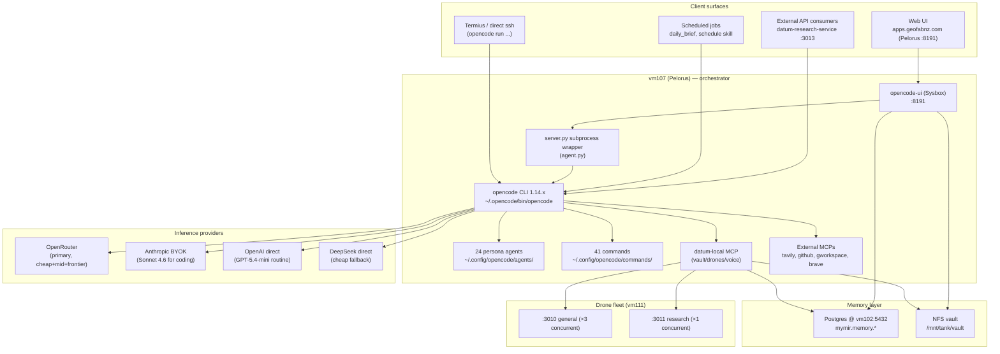
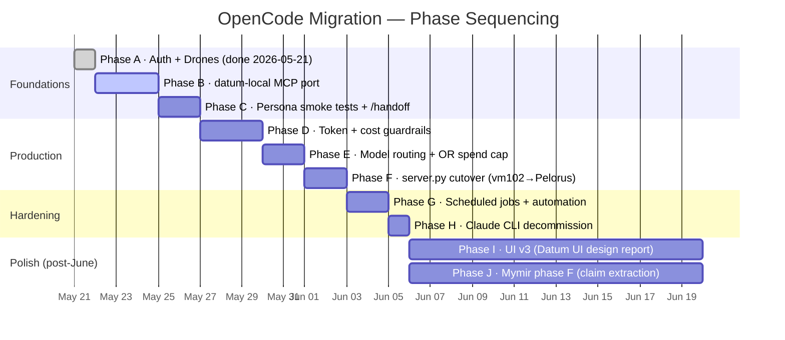
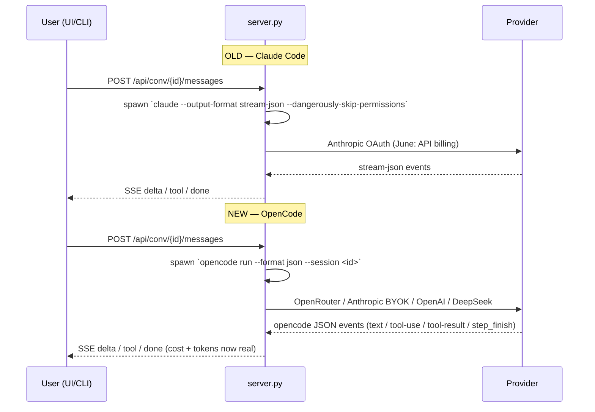

# OpenCode Migration — Datum Platform-Wide Cutover

**Status:** Phase 0 (spec)
**Owner:** Manager
**Driver:** Anthropic moves all `claude -p` (Claude Code OAuth) to API billing in June 2026. Continuing on Claude Code becomes economically untenable for Datum's persona + drone footprint.
**Target:** Platform-wide cutover from `claude` CLI subprocess to `opencode` CLI subprocess (sst/opencode), with model routing via OpenRouter + BYOK. Pelorus (vm107) is the staging host; vm102 follows once Pelorus is stable.
**GitHub:** [mrodger/Datum-v2.0](https://github.com/mrodger/Datum-v2.0)
**GDrive mirror:** `~/gdrive/Datum OpenCode Migration/` (auto-synced)
**Methodology:** Leyline planning sessions per phase. This document is the umbrella plan; each phase gets its own Leyline plan/execute/verify cycle.

---

## Why this exists

Datum runs a Claude Code CLI subprocess in every agent surface — `datum-ui`, `opencode-ui` (already swapped), `datum-research-service`, the drone fleet, `daily_brief.sh`, scheduled jobs, and direct Termius sessions across 11 personas. Anthropic's June OAuth retirement turns every one of those invocations into a metered API call. At current usage (~$0.02–$0.05 per typical persona turn × hundreds of turns/week × 24 personas), the resulting bill is multiples of what an equivalent OpenRouter-routed OpenCode pipeline costs, and the savings compound when routine work is moved to cheap open-weight models.

OpenCode is the architecturally-closest drop-in. Five May 2026 research reports cover the migration path, MCP/container security, inference provider selection, cost optimisation, memory-layer porting, and UI upgrades. Batch 1 (Pelorus platform migration) is **closed**. This project picks up where Batch 1 left off and ships the platform-wide cutover before June.

---

## Scope umbrella — existing batches

| Batch | Scope | Status |
|---|---|---|
| 1 | OpenCode CLI + 24 agents + 41 commands + 4 MCPs on Pelorus (vm107) | **Closed** 2026-05-14 |
| 1.5 | Token capture + per-task guardrails in `opencode-ui/agent.py` | **Deferred** — re-opened in Batch 3 phase D (now blocking) |
| 2 | Mymir Postgres memory layer — `memory.*` schema (14 tables), backfill | **Phase E closed** 2026-05-20. Phase F (claim extraction) deferred |
| **3 (this project)** | **Claude Code retirement: platform-wide cutover before June** | **Phase 0 (this spec)** |
| 4 (post-cutover) | Mymir phase F (claim extraction), UI v3, batch-2 sub-plans 3+ | Deferred until Batch 3 closes |

Sequencing: **finish Batch 3, then resume Batch 2 phase F.** Compounding two big migrations doubles risk for no upside.

---

## Success criteria (acceptance gates for June)

1. `claude` CLI is not invoked anywhere in the Datum production path. `grep -rE "claude " ~/projects ~/tools` returns nothing the migration didn't deliberately leave.
2. `opencode` runs cleanly from any non-interactive ssh on Pelorus and vm102, with no manual env sourcing.
3. All 24 personas have working OpenCode agent files and pass a /persona + /handoff smoke test.
4. All Claude-Code-driven MCPs (`datum-local`, vault search, drone dispatch, voice TTS, conversation CRUD) are accessible from OpenCode personas.
5. Per-task cost ceilings, token caps, and circuit breakers are wired and visible in the UI/logs.
6. OpenRouter monthly budget cap is set; per-persona model routing is in `opencode.json`.
7. Total measured spend on representative one-week workload is ≤30% of Claude-Code-equivalent cost.
8. `datum-ui` on vm102 retired or in read-only archive mode; `opencode-ui` on Pelorus is the daily driver at `apps.geofabnz.com`.

---

## Architecture (target state)

---

## Phases (Leyline-tracked)

Each phase below is one Leyline plan/execute/verify cycle. Numbering is execution order, not equal weight.

### Phase A — Auth + drones ✅ **DONE 2026-05-21**

Moved `~/.secrets.env` source line above the interactive guard in vm107 `~/.bashrc`. `opencode auth list` now picks up 4 providers from env on non-interactive ssh. Verified `opencode run --model openrouter/openai/gpt-5.4-mini "ping"` returns clean. Confirmed drones at `192.168.88.111:3010` and `:3011` reachable; the 2026-05-14 "vm106 unreachable" handoff note was stale (drones moved to vm111 on 2026-05-16).

### Phase B — datum-local MCP port 🟡 **NEXT**

The Claude Code session here has access to `datum-local` MCP with vault_search, vault_read, conversation_*, dispatch_drone, voice_tts, leaflet_map, nzffd_download, screenshot_url, skill_execute, etc. OpenCode side only has tavily/github/gworkspace/brave + agent-manager (in-container). This is the biggest remaining functional gap.

**Approach:** datum-local is already an MCP server (stdio transport per the existing claude config). Add it to `~/.config/opencode/opencode.json` under `mcp` with the same command path. No rewrite required.

**Acceptance:** opencode session can call `vault_search "manager tasks"`, `dispatch_drone "test task"`, and `voice_tts "ok"` without errors.

### Phase C — Persona smoke tests + /handoff

Walk each of the 24 personas through a minimal interaction: `opencode run --agent <persona> "init"`, verify the startup block renders correctly, verify `/handoff --tokens N --notes 'smoke'` writes to the right files. Capture any divergence from Claude Code's behaviour into `decisions/persona-smoke.md`.

**Acceptance:** all 24 personas pass; differences documented.

### Phase D — Token + cost guardrails (Batch 1.5 unfrozen)

`opencode-ui/agent.py` currently returns `cost_usd=0, input_tokens=0, output_tokens=0`. The opencode JSON stream includes a `step_finish` event with `tokens.{input,output,reasoning,cache}` and `cost` — wire these into the `done` event. Add per-task token cap (default 100k input, 20k output), per-task USD cap (default $0.50), and circuit breaker at 3× estimate. Surface in UI status bar.

**Acceptance:** Real cost visible per message. Tasks that exceed cap terminate cleanly with a clear error.

### Phase E — Model routing + OpenRouter spend cap

**Decision 2026-05-21:** OpenAI direct only for the cutover. No Anthropic BYOK, no DeepSeek, no OpenRouter passthrough for routine inference. Three tiers — `gpt-5.4-nano`, `gpt-5.4-mini`, `gpt-5.4` — cover the whole persona fleet. Simpler bill, one cap, one vendor surface for Phase D+E. OpenRouter stays as MCP-side optionality (research drones may still use it for tool variety) but not the default for personas. Anthropic can be re-introduced in Phase I+ if Sonnet 4.6 is missed on coding tasks.

Per-persona model routing in `opencode.json`:

| Persona | Default | Premium | Cheap (status/lookup) |
|---|---|---|---|
| developer | gpt-5.4 | gpt-5.4 | gpt-5.4-mini |
| manager | gpt-5.4 | gpt-5.4 | gpt-5.4-mini |
| researcher | gpt-5.4 | gpt-5.4 | gpt-5.4-mini |
| gis-analyst | gpt-5.4-mini | gpt-5.4 | gpt-5.4-nano |
| security | gpt-5.4 | gpt-5.4 | gpt-5.4-mini |
| designer | gpt-5.4-mini | gpt-5.4 | gpt-5.4-nano |
| outreach, sysadmin, entrepreneur, chat | gpt-5.4-mini | gpt-5.4-mini | gpt-5.4-nano |
| onboarding | gpt-5.4-nano | gpt-5.4-mini | gpt-5.4-nano |
| drones (general) | gpt-5.4-mini | — | gpt-5.4-nano |
| drones (research) | gpt-5.4-mini | gpt-5.4 | gpt-5.4-mini |

Set OpenAI monthly cap at $80 (alerts at 50/80/95%). OpenRouter cap stays in place but throttled — research-drone bursts only.

**Acceptance:** spend cap live in OpenAI dashboard. Per-persona routing renders in startup block. Cost projection from one-week dry-run ≤ target.

### Phase F — server.py cutover (vm102 → Pelorus, cold standby)

`datum-ui` on vm102 still uses the `claude` subprocess. `opencode-ui` on Pelorus has the swap done (agent.py wraps `opencode run --format json`).

**Decision 2026-05-21:** Cold standby for 30 days. DNS swaps `apps.geofabnz.com` → vm107:8191. vm102 datum-ui stays installed but `systemctl stop`'d, service masked, NFS vault writer disabled. Database snapshot taken pre-cutover. After 30 days of clean Pelorus operation, vm102 datum-ui is archived (DB exported, service uninstalled) and the VM either repurposed or shut down.

**Acceptance:**
- apps.geofabnz.com served from Pelorus.
- vm102 datum-ui stopped + masked, snapshot stored in `~/vault/projects/opencode-migration/archive/vm102-datum-ui-pre-cutover.db.gz`.
- NFS vault writer test: single writer confirmed (Pelorus only).
- 30-day calendar reminder scheduled for vm102 archival decision.

### Phase G — Scheduled jobs + automation

Every cron / systemd timer / scheduled task that invokes `claude` directly needs to swap to `opencode`. Inventory:

- `daily_brief.sh`
- `schedule` skill (systemd timers)
- `vault-sync.log` driver (if any)
- Any drone bootstrap scripts that call `claude` for setup

**Acceptance:** `grep -rE '\bclaude\b' ~/tools ~/projects/*/cron* ~/projects/*/*.sh` returns only deliberate/documented occurrences.

### Phase H — Claude CLI decommission

Once A–G are green, remove `claude` CLI from the Datum production path. Keep it installed for emergency rollback for 30 days. Document the rollback procedure in `RUNBOOK.md`.

**Acceptance:** Sign-off gate. June 1 internal deadline.

### Phase I — UI v3 (post-cutover polish)

Sourced from `datum-ui-design-2026.md`. Five upgrade vectors: PWA fundamentals (manifest + service worker + install prompt), artifact-pane rendering refresh (Monaco + MapLibre + AG Grid), multi-agent orchestration UI (drone fleet visibility, cost/turn dashboards), design system polish (Vercel/Linear/Raycast/Cursor reference), 3D thought viewer for long-running drone tasks.

**Deferred until Batch 3 closes.** This is something Pelorus can produce semi-autonomously with the designer persona once stable.

### Phase J — Mymir phase F (claim extraction)

Resume Batch 2. memory.* schema is populated (messages 15314, conversations 255, agents 15). Claims/episodes/procedures empty. LLM extraction pipeline + HNSW dedup + retention policy.

**Deferred until Batch 3 closes.**

---

## Priority sort (June viability)

**Critical path (must ship before June):** A → B → C → D → E → F → G → H

**Nice to have (Pelorus agent can self-improve post-cutover):** I, J

The priority rule the user set: anything the Pelorus agent can build for itself once viable is **lower** priority than what makes it viable in the first place. UI polish, claim extraction, and similar improvements all live on the Pelorus-self-improvement side.

---

## Subprocess swap diff (informational)

The wrapper is already implemented in `~/projects/opencode-ui/agent.py` on Pelorus. The two pieces missing are: (a) cost+token capture in `step_finish`, (b) port to vm102's `~/projects/datum-ui/server.py`.

---

## Risk register

| Risk | Likelihood | Impact | Mitigation |
|---|---|---|---|
| OpenRouter outage during cutover week | Medium | High | BYOK Anthropic + OpenAI direct as fallback providers in opencode.json |
| Persona behaviour drift on non-Claude models | Medium | Medium | Phase C smoke tests with documented diffs; keep Claude BYOK as escalation tier |
| NFS vault write contention vm102↔vm107 | High (already observed) | Medium | Phase F closes this by retiring vm102 datum-ui |
| Cost spike from un-capped runaway agent loop | Medium | High | Phase D guardrails + OpenRouter monthly cap |
| MCP regression (datum-local features fail under opencode) | Medium | High | Phase B explicit per-tool acceptance test |
| Token-counting drift (estimate ≠ billed) | Low | Low | Phase D wires real token counts from opencode JSON, not estimates |

---

## Cost projection (one-week representative workload)

Baseline (Claude Code OAuth, current): ~$0/week direct, ~$N/month under the new API billing model (unknown, but Anthropic's stated 1.25× cache write + 0.1× cache read + $3/M input + $15/M output on Sonnet 4.6 implies multiples of $100/month for Datum's footprint).

Target (OpenCode + OpenAI direct, three-tier):

| Tier | Model | $/1M in | $/1M out | Use |
|---|---|---|---|---|
| Nano | gpt-5.4-nano | 0.20 | 0.80 | status checks, lookups, drone fan-out, onboarding |
| Mini | gpt-5.4-mini | 2.50 | 10.00 | routine personas, drones default, designer, outreach |
| Full | gpt-5.4 | 2.50 (OpenAI direct) | 10.00 | developer, manager, security, researcher, multi-step planning |

Estimated weekly spend at current usage: **$6–$12/week ≈ $25–$50/month** with prompt caching applied. Removing Anthropic BYOK and DeepSeek shifts the bottom of the range down (single-vendor caching is more predictable). Phase D + E numbers will replace this estimate with actuals.

---

## Governance

- **Methodology:** Leyline plan/execute/verify per phase. No phase ships without `lite-verify` evidence.
- **Living document:** this README is the umbrella. Each phase has its own folder under `phases/` (created when started) with `plan.md`, `execute.md`, `verify.md`.
- **GDrive mirror:** `~/gdrive/Datum OpenCode Migration/` — rclone push on each phase close.
- **GitHub:** `mrodger/Datum-v2.0` — repo currently hosts a Codex Drone implementation on `main` and a Next.js scaffold on `datum-v2-main`. **Open question:** does this project create a third branch (`opencode-migration`) or get a sibling repo? Pending Marcus decision.
- **Diagrams:** mermaid placeholders in this doc. Designer will replace with branded SVG/PDF (see `~/vault/shared/handoff.md`).

---

## Decisions (resolved 2026-05-21)

1. **GitHub layout.** ✅ New branch `opencode-migration` on `mrodger/Datum-v2.0`.
2. **vm102 retirement.** ✅ Cold standby for 30 days, then archive.
3. **Provider strategy.** ✅ OpenAI direct only (gpt-5.4-nano / -mini / -full). No Anthropic BYOK, no DeepSeek for Phase 3. OpenRouter retained for MCP optionality only.
4. **Drone routing.** ✅ Default `gpt-5.4-mini`. Nano for fan-out/status. Research drones may escalate to full on a per-task basis.
5. **Stratum / datum-mcp coupling.** 🟡 **Open — see "Stratum MCP discussion" below.**

## Stratum MCP discussion

Stratum already exposes its own MCP surface (`datum-mcp` v0.4.0, 16 tools, 26 prompts). It overlaps with `datum-local` on a few primitives (conversation CRUD, vault touch points) but is otherwise its own thing — workspace/project orchestration, code-library indexing, RAG-vault queries.

Two coupling models to choose between:

| Model | Pros | Cons |
|---|---|---|
| **A. Decoupled** — Stratum stays standalone, OpenCode personas reach it via its own MCP stdio just like any other MCP | No code changes. Stratum keeps its release cycle. Personas opt-in per-config. | Two parallel MCP servers with some surface overlap. Risk of "which one does X?" confusion. |
| **B. Stratum delegates to `datum-local`** — Stratum becomes a thin shell calling into datum-local for the shared primitives | Single source of truth for vault/conversation. Easier to audit governance. Cheaper to maintain long-term. | Real engineering work. Stratum has its own consumers — break them and we own that fallout. |

**Recommendation:** **Model A for Batch 3**, with Model B as a Batch 4 explicit project once the cutover is done. Reason: Stratum's surface is wider than just "vault primitives" — touching it now multiplies risk on a deadline that is already tight. Document the overlap as a known cost rather than a blocker. If the duplication starts producing user-visible drift before Batch 4, escalate sooner.

Concrete actions inside Batch 3:
- Phase B: register Stratum's MCP in `opencode.json` alongside `datum-local`. Don't merge them.
- Phase C: persona smoke test includes a Stratum tool call to confirm coexistence.
- Phase D: cost guardrails apply regardless of which MCP triggered the tool — counter is per-task, not per-MCP.

Phase J or a new Batch 4 sub-plan handles consolidation once we have one week of co-existence data.

---

## References

- `~/vault/research/opencode-migration-2026.md` — 6-phase migration playbook
- `~/vault/research/datum-opencode-inference-stack-2026.md` — provider/model pricing
- `~/vault/research/datum-opencode-mcp-containers-2026.md` — MCP + container security
- `~/vault/research/datum-cost-optimization-2026.md` — routing + caching + drone fleet cost control
- `~/vault/research/opencode-memory-injection-2026.md` — memory file injection patterns
- `~/vault/research/datum-ui-design-2026.md` — UI v3 (Phase I)
- `~/vault/research/datum-postgres-memory-2026.md` — Batch 2 (deferred)
- `~/vault/research/datum-implementation-batches-2026.md` — prior batch grouping (this doc supersedes for Batch 3)
